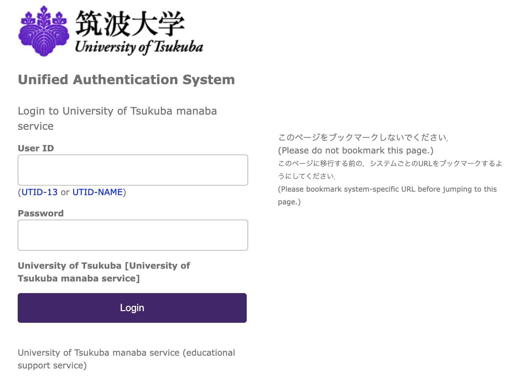

# manaba enterer

You can login manaba w/o any mouse movement.
Once fill the inputs w/ password manager, all you have to do is just press the enter key.

## Usage

1. Go to [chrome://extensions/](chrome://extensions/)

2. Turn on 'Developer mode'.

3. Click 'Load unpacked' and load this extension.

You can find a change of login button if the extension is loaded correctly!

## Note

> Uncaught TypeError: Cannot read properties of null (reading 'style')

In your chrome extensions tab, you will see the error message above.
Don't worry, you can ignore it. It won't affect your experience.